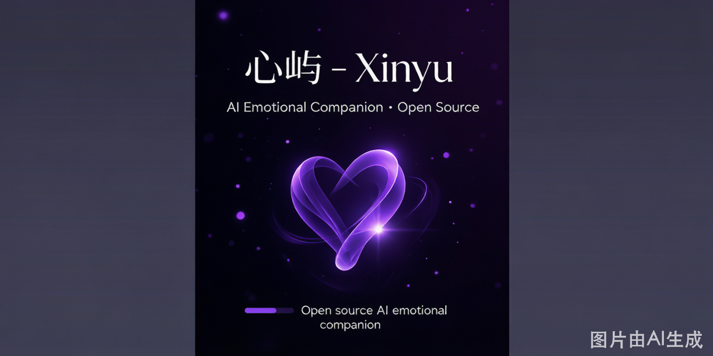

<div align="center">


<picture>
  <source media="(prefers-color-scheme: dark)" srcset="assets/social-preview.png">
  
</picture>

# 心屿 · AI 情感陪伴

> 你不会消失，记忆永远在线，备份另外一个你。

**🌐 线上体验：** [https://aiyy.chulianpp.cn](https://aiyy.chulianpp.cn) · **⭐ Star 支持：** [GitHub](https://github.com/a927991499-cyber/xinyu)

</div>

---

## English Introduction

**Xinyu** is an open-source AI emotional companion that brings your virtual character to life. It features:

- 🎭 **Live2D Interactive Avatar** with facial expressions & lip sync
- 💬 **Emotion-aware Conversations** powered by DeepSeek API (16 emotions)
- 🧠 **Long-term Memory System** — flash/profile/event three-tier architecture
- 🧬 **Persona Analysis** — 7-dimension personality profiling from conversations
- 🔊 **CosyVoice TTS** with emotional voice output
- 📱 **Community Features** — posts, comments, likes, admin panel

**Tech Stack**: Next.js 16 · TypeScript · Tailwind CSS · SQLite · DeepSeek · CosyVoice · Live2D Cubism SDK

> 👉 [Try the live demo](https://aiyy.chulianpp.cn) · No login required

---

> 🎬 功能演示 / Demo Video：

<video src="assets/demo.mp4" controls width="100%"></video>

*如果视频无法播放，请点击 [这里](https://raw.githubusercontent.com/a927991499-cyber/xinyu/main/assets/demo.mp4) 直接下载观看。*

---

## ✨ 功能特性

### 🎭 Live2D 交互角色
- 可交互的 3D 角色（小雪），支持表情变化、唇形同步
- 情感状态驱动角色表情和动作
- 换装系统，多种服装搭配

### 💬 智能对话
- 基于 DeepSeek API 的情感化对话
- 16 种情感状态识别与转场（开心、难过、害羞、思念等）
- 情绪衰减系统，转场自然不突兀
- 文本导演系统，回复更自然口语化

### 🧠 记忆系统
- 自动从对话中提取用户信息（偏好、工作、情绪、习惯等）
- 按类别分类存储记忆
- 长期记忆总结和画像生成
- 三层记忆架构：闪存/画像/事件

### 🧬 人格分身（Persona）
- 7 维度人格画像（说话风格、兴趣爱好、情绪模式、价值观等）
- 从对话中自动提取人格特征
- 人格完整度进度追踪
- 可分享的人格时间线

### 📱 社区功能
- 用户发帖、评论、点赞
- 图片上传与轮播
- 管理后台（内容管理、用户管理、系统设置）

### 🔐 用户系统
- 短信验证码登录
- 个人中心（头像、昵称、设置）
- 数字遗产联系人功能
- 会员系统

### 🔊 语音系统（CosyVoice）
- 阿里云百炼 CosyVoice TTS 语音合成
- 情感化语音输出（支持开心、难过等多种情绪语气）
- 可调节语速、音调、音量

### 🖼️ AI 图片生成
- 基于可灵 AI 模型的角色图片生成
- 参考图保真人设一致性
- 对话场景驱动的自动提示词生成

### 🏠 精美首页
- 参考主流社交应用设计的首页排版
- 今日状态仪表盘
- 关系进度追踪
- 自适应卡片布局，紫色主题配色

---

## 🛠️ 技术栈

| 领域 | 技术 |
|------|------|
| **框架** | Next.js 16 (App Router) |
| **语言** | TypeScript |
| **样式** | Tailwind CSS |
| **数据库** | SQLite (better-sqlite3) |
| **AI 对话** | DeepSeek API |
| **语音合成** | 阿里云百炼 CosyVoice |
| **图片生成** | 可灵 AI (Kling) |
| **Live2D** | Cubism SDK |
| **部署** | PM2 + Nginx (CentOS) |

---

## 🚀 快速开始

### 前置要求

- Node.js >= 18
- pnpm

### 1. 安装

```bash
git clone https://github.com/a927991499-cyber/xinyu.git
cd xinyu
pnpm install
```

### 2. 配置环境变量

```bash
cp .env.local.example .env.local
```

编辑 `.env.local`，填入你的 API Key：

**必填：**
```env
DEEPSEEK_API_KEY=your_deepseek_api_key
ADMIN_PASSWORD=your_admin_password
```

**语音功能（可选）：**
```env
DASHSCOPE_API_KEY=your_dashscope_api_key
COSYVOICE_VOICE=longwan_v3
COSYVOICE_MODEL=cosyvoice-v3-flash
```

**图片生成（可选）：**
```env
KLING_API_KEY=your_kling_api_key
```

### 3. 启动

```bash
pnpm dev
```

访问 http://localhost:3000

---

## 📁 项目结构

```
├── app/                    # Next.js 页面路由
│   ├── api/                # API 路由
│   │   ├── chat/          # 对话 API
│   │   ├── persona/       # 人格分身 API
│   │   ├── community/     # 社区 API
│   │   └── admin/         # 管理后台 API
│   ├── home/              # 首页
│   ├── profile/           # 个人中心
│   ├── community/         # 社区
│   ├── persona/           # 人格分身页面
│   └── admin/             # 管理后台
├── lib/                    # 核心业务逻辑
│   ├── emotion/           # 情感状态机
│   ├── memory/            # 记忆系统
│   ├── voice-system/      # 语音系统
│   ├── persona-extractor.ts # 人格提取
│   ├── persona-summarizer.ts # 人格总结
│   ├── state-engine.ts    # 数字大脑状态引擎
│   └── text-director.ts   # 文本导演
├── components/            # UI 组件
├── public/                # 静态资源
└── .env.local.example     # 环境变量示例
```

---

## 🤝 贡献指南

欢迎任何形式的贡献！你可以：

- ⭐ **Star 本项目** — 让更多人看到
- 🐛 **提交 Issue** — 报告 Bug 或提出新功能建议
- 🔀 **提交 Pull Request** — 直接改进代码
- 💬 **参与 Discussions** — 讨论项目方向

---

## 📄 开源协议

MIT License © 2026 心屿 (Xinyu)

---

<div align="center">
  
**心屿 · 用 AI 温暖你的每一天**

*如果这个项目对你有帮助，请给一个 ⭐ Star 支持！*

</div>
